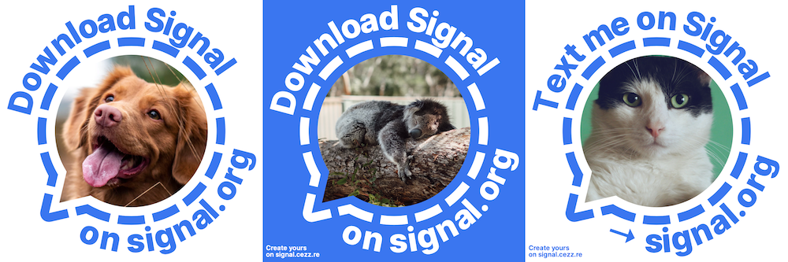

# Switch to Signal — Profile picture generator

Profile picture generator to help other people switch to Signal.

_Photos by [Jamie Street](https://unsplash.com/@jamie452) (dog), [Siem van Woerkom](https://unsplash.com/@chippedwood) (koala) and [Manja Vitolic](https://unsplash.com/@madhatterzone) (cat)._

## Functionalities

- **Select your own picture**. _Your picture never leaves your computer. It's 100% local._
- Click the top and bottom text to **personalise** it.
- Click the bottom left button to **invert colours**.
- Click the bottom right button to **download your picture**.

## Credits

- Built with [Vue](https://github.com/vuejs/vue), [Vue-i18n](https://github.com/kazupon/vue-i18n), [Typescript](https://github.com/microsoft/TypeScript), [SASS](https://github.com/sass/sass) and [Canvg](https://github.com/canvg/canvg).
- Fonts by [Inter](https://github.com/rsms/inter).
- Icons by [Feather](https://github.com/feathericons/feather).
